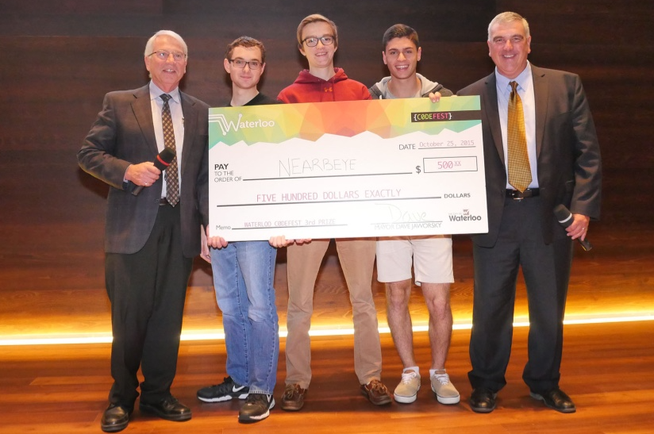
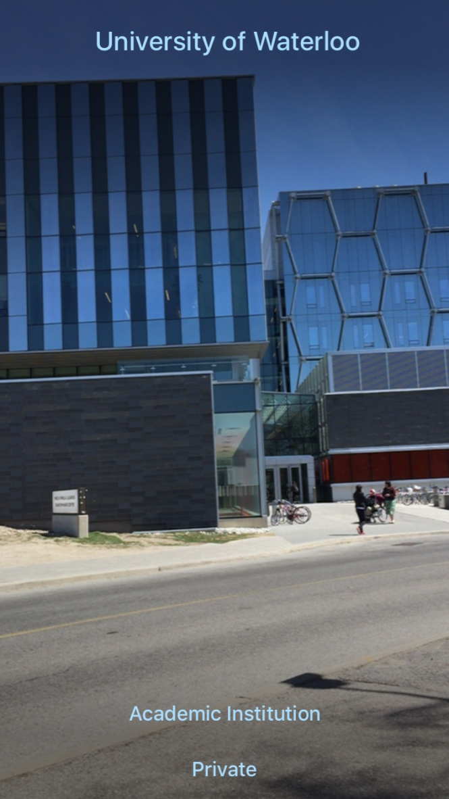
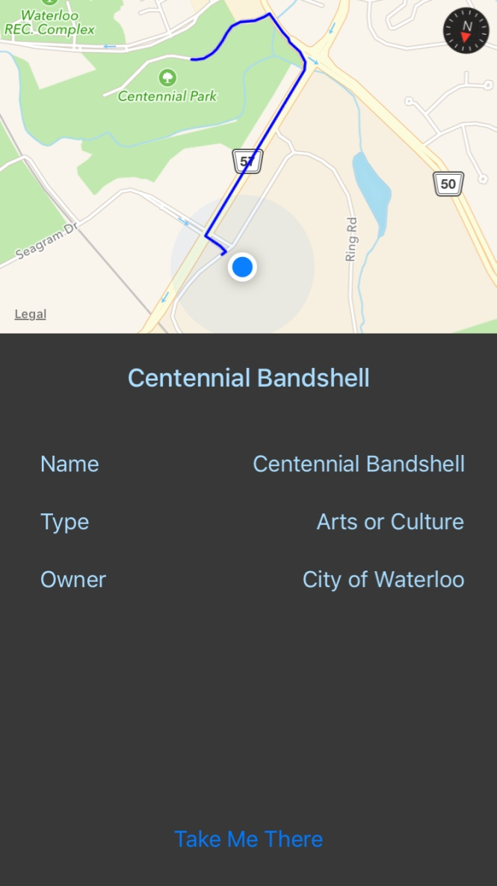

# NearbEYE

NearbEYE is an augmented reality iOS application that helps you explore the city of Waterloo with your smartphone. NearbEYE utilizes open data from the City of Waterloo to provide informative, relevant information to the user. NearbEYE shows you information about nearby locations in the direction you are currently looking through a powerful custom algorithm. It won 3rd place at the City of Waterloo's [Codefest Hackathon](http://www.waterloo.ca/en/government/WaterlooCodefest.asp).

NearbEYE was created by:
- [Aaron Cotter](http://aaroncotter.me)
- Ethan Hardy 
- [Stephen Melinyshyn](http://melinysh.me)

